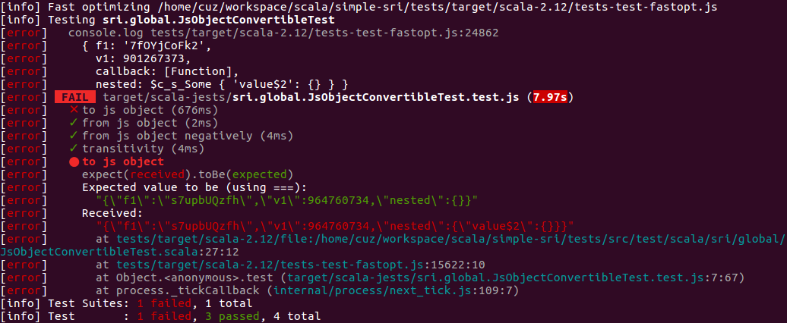

# Scala-jest
Write `jest` tests as scala classes and run them within sbt without any hassle.

### Motivation
* To workaround scala.js issue [#2635](https://github.com/scala-js/scala-js/issues/2635).
* To provide a better test ability against nodejs + jsdom + CommonJS on scala.js.
* That is: test your scala.js-react project just by `sbt test`



### Setup

Prerequisites:

* nodejs (probably higher than v8.7.0) 
* a `package.json`, or `npm init` to make one
* `npm install --save-dev jest`

_See scala.js doc for file path conventions._

Dependency:

    libraryDependencies += "com.github.cuzfrog" %%% "sjest" % "0.1.0-SNAPSHOT" Test

Provide test Framework(to specify client build info):

```scala
import sjest.JestFramework
private final class MyTestFramework extends JestFramework {
  private val project = "tests"
  //where the *opt.js file is:
  override protected def optJsPath = s"$project/target/scala-2.12/sjest-tests-test-fastopt.js"
  //where to put generated *.test.js files:
  override protected def testJsDir = s"$project/target/sjests/"
}
```

Add test framework to sbt:

    testFrameworks += new TestFramework("your.package.MyTestFramework")

### It's simple to use:

Write dom test:

```scala
import org.scalajs.dom

object MyTest extends sjest.JestSuite {
  test("this is a failed test") {
    expect(1 + 1).toBe(5)
  }

  test("dom test") {
    val div = dom.document.createElement("div")
    div.setAttribute("id","my-id-is-app")
    val body = dom.document.body.appendChild(div)
    val found = dom.document.getElementById("my-id-is-app")
    expect(found).toBe(div)
  }
}
```

Write test with shared variable:

```scala
object MyTestWithSharedVariable extends sjest.JestSuite{
  private var marker: Int = 0

  beforeEach {
    marker += 1
  }
  
  describe("outer1") {
    describe("inner2") {
      test("test2-1") {
        marker += 1
        println("do some test2-1!")
      }
    }
    test("test2-3") {
      marker += 1
      println("do some test2-3!")
    }
  }
    
  afterAll {
    println(marker) //4
    //Note: assertion here is useless, error here simply gets ignored by jest.
  }
}
```

Then sbt `test` or `testOnly` like you do in any other scala test framework.

_You can pass `jest` configs directly from console:_

    test -- --bail --verbose

### More config:

See more configs in [JestFramework](src/main/scala/sjest/JestFramework.scala)
```scala
abstract class JestFramework{
  /** Yield test command, given a test.js file path. Jest configs can be put here. */
  protected def nodejsCmd(jsTestPath: String): NodejsCmd = (jsTestPath: String) =>
     NodejsCmd("node_modules/jest/bin/jest.js", js.Array("--colors", "--bail", jsTestPath))
  
  /** Whether to run actual test by `'sbt test'`. <br>
   * 'jest xx.test.js' is executed for every test, thus worse performance.
   * One could disable it by set this to false, and manually run jest from command line.
   */
  protected def autoRunTestInSbt: Boolean
  
  /** Filter jest output in sbt console */
  protected def jestOutputFilter: String => String
}
```

### How it works?
Scala-jest exposes client tests in `*opt.js`, and generates `*.test.js` files to call them,
executed by nodejs' `child_process`, which then triggers [jest](https://facebook.github.io/jest).
So scala.js is not involved the when testing is running, only the stdout/err shown in sbt console.

A drawback is that file paths are not managed by sbt, and must be set manually.
 
### About
 
Author: Cause Chung (cuzfrog@139.com)
 
License: Apache License Version 2.0